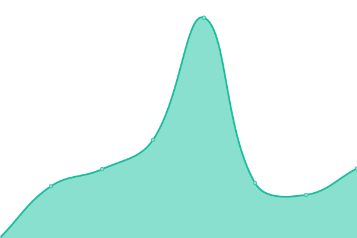
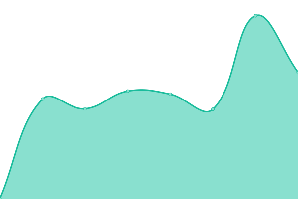
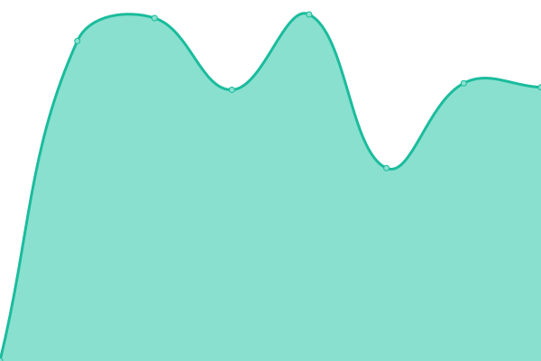
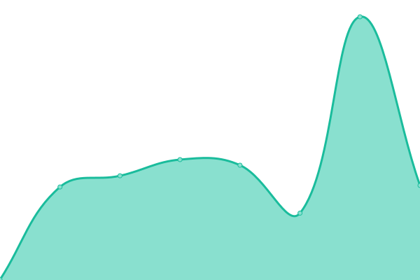
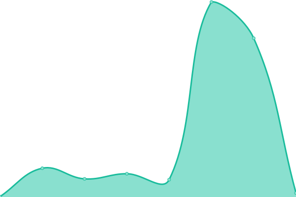

# [📈 Live Status](https://periodo.github.io/status): <!--live status--> **🟧 Partial outage**

This repository manages status and uptime monitoring for [PeriodO](http://perio.do).

<!--start: status pages-->
<!-- This summary is generated by Upptime (https://github.com/upptime/upptime) -->
<!-- Do not edit this manually, your changes will be overwritten -->
<!-- prettier-ignore -->
| URL | Status | History | Response Time | Uptime |
| --- | ------ | ------- | ------------- | ------ |
|  [PeriodO data](https://data.perio.do) | 🟩 Up | [period-o-data.yml](https://github.com/periodo/periodo-status/commits/HEAD/history/period-o-data.yml) | 

 180ms
     
 | 

<a href="https://status.perio.do/history/period-o-data">97.56%</a>
    

|  [PeriodO client](https://client.perio.do) | 🟩 Up | [period-o-client.yml](https://github.com/periodo/periodo-status/commits/HEAD/history/period-o-client.yml) | 

 154ms
     
 | 

<a href="https://status.perio.do/history/period-o-client">97.58%</a>
    

|  [PeriodO TTL](https://n2t.net/ark:/99152/p0dataset.ttl) | 🟥 Down | [period-o-ttl.yml](https://github.com/periodo/periodo-status/commits/HEAD/history/period-o-ttl.yml) | 

 1498ms
     
 | 

<a href="https://status.perio.do/history/period-o-ttl">97.22%</a>
    

|  [PeriodO CSV](https://n2t.net/ark:/99152/p0dataset.csv) | 🟥 Down | [period-o-csv.yml](https://github.com/periodo/periodo-status/commits/HEAD/history/period-o-csv.yml) | 

 273ms
     
 | 

<a href="https://status.perio.do/history/period-o-csv">97.26%</a>
    

|  [PeriodO places graph](https://data.perio.do/graphs/places) | 🟩 Up | [period-o-places-graph.yml](https://github.com/periodo/periodo-status/commits/HEAD/history/period-o-places-graph.yml) | 

 35ms
     
 | 

<a href="https://status.perio.do/history/period-o-places-graph">97.65%</a>
    

|  [PeriodO legacy subdomain](https://test.perio.do) | 🟩 Up | [period-o-legacy-subdomain.yml](https://github.com/periodo/periodo-status/commits/HEAD/history/period-o-legacy-subdomain.yml) | 

 921ms
     
 | 

<a href="https://status.perio.do/history/period-o-legacy-subdomain">97.46%</a>
    

<!--end: status pages-->

[**Visit our status website →**](https://periodo.github.io/periodo-status)
