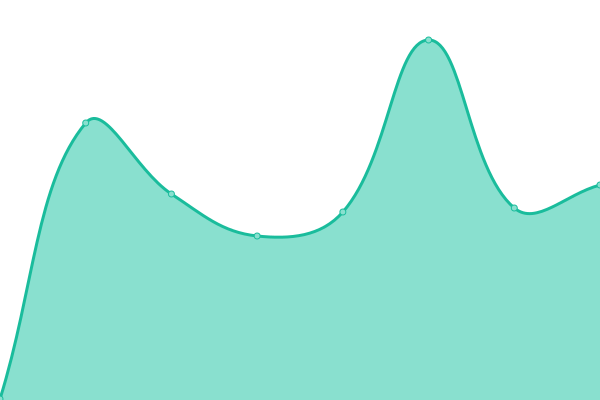
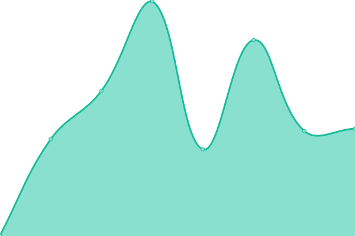
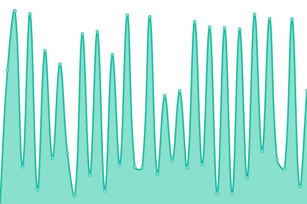
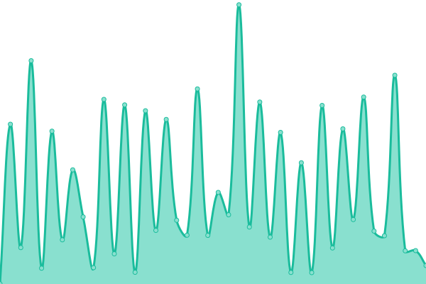
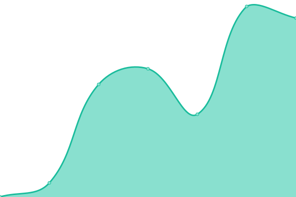
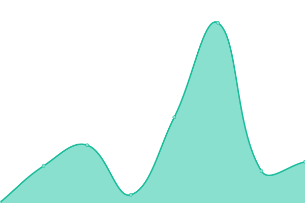

# [📈 Live Status](https://periodo.github.io/status): <!--live status--> **🟧 Partial outage**

This repository manages status and uptime monitoring for [PeriodO](http://perio.do).

<!--start: status pages-->
<!-- This summary is generated by Upptime (https://github.com/upptime/upptime) -->
<!-- Do not edit this manually, your changes will be overwritten -->
<!-- prettier-ignore -->
| URL | Status | History | Response Time | Uptime |
| --- | ------ | ------- | ------------- | ------ |
|  [PeriodO data](https://data.perio.do) | 🟩 Up | [period-o-data.yml](https://github.com/periodo/periodo-status/commits/HEAD/history/period-o-data.yml) | 

 220ms
     
 | 

<a href="https://status.perio.do/history/period-o-data">100.00%</a>
    

|  [PeriodO client](https://client.perio.do) | 🟩 Up | [period-o-client.yml](https://github.com/periodo/periodo-status/commits/HEAD/history/period-o-client.yml) | 

 196ms
     
 | 

<a href="https://status.perio.do/history/period-o-client">100.00%</a>
    

|  [PeriodO TTL](https://data.perio.do/dataset.ttl) | 🟩 Up | [period-o-ttl.yml](https://github.com/periodo/periodo-status/commits/HEAD/history/period-o-ttl.yml) | 

 450ms
     
 | 

<a href="https://status.perio.do/history/period-o-ttl">100.00%</a>
    

|  [PeriodO CSV](https://data.perio.do/dataset.csv) | 🟩 Up | [period-o-csv.yml](https://github.com/periodo/periodo-status/commits/HEAD/history/period-o-csv.yml) | 

 167ms
     
 | 

<a href="https://status.perio.do/history/period-o-csv">100.00%</a>
    

|  [PeriodO ARK resolution (n2t.net)](https://n2t.net/ark:/99152/p0dataset.json) | 🟥 Down | [period-o-ark-resolution-n2t-net.yml](https://github.com/periodo/periodo-status/commits/HEAD/history/period-o-ark-resolution-n2t-net.yml) | 

 809ms
     
 | 

<a href="https://status.perio.do/history/period-o-ark-resolution-n2t-net">97.67%</a>
    

|  [PeriodO places graph](https://data.perio.do/graphs/places) | 🟩 Up | [period-o-places-graph.yml](https://github.com/periodo/periodo-status/commits/HEAD/history/period-o-places-graph.yml) | 

 173ms
     
 | 

<a href="https://status.perio.do/history/period-o-places-graph">100.00%</a>
    

|  [PeriodO legacy subdomain](https://test.perio.do) | 🟩 Up | [period-o-legacy-subdomain.yml](https://github.com/periodo/periodo-status/commits/HEAD/history/period-o-legacy-subdomain.yml) | 

 1928ms
     
 | 

<a href="https://status.perio.do/history/period-o-legacy-subdomain">100.00%</a>
    

<!--end: status pages-->

[**Visit our status website →**](https://periodo.github.io/periodo-status)
